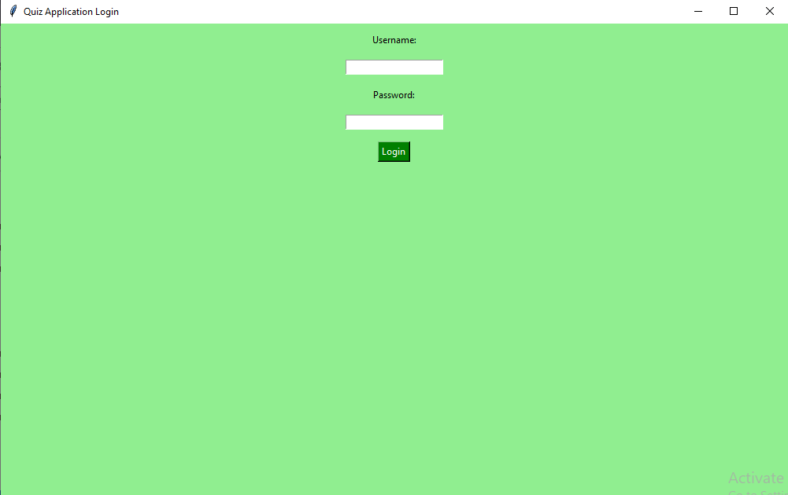
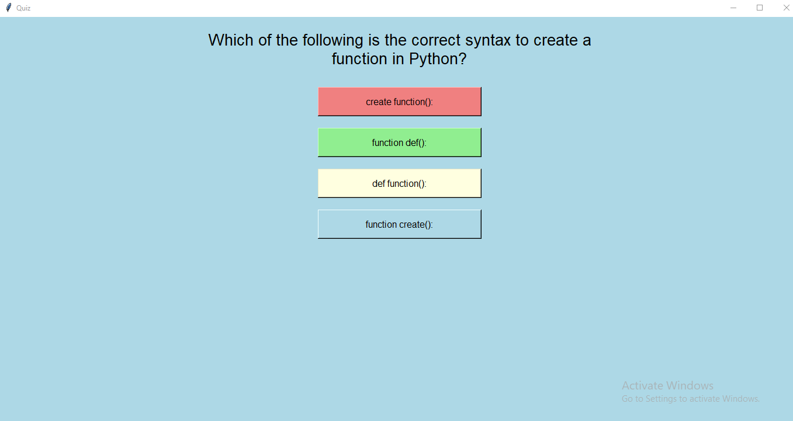

 This is a simple Python application built using tkinter for a quiz-based interface with a login system. The application consists of two main windows: a login window and a quiz window. 

<b>Features:</b>
<b>Login System:</b>
Users are required to log in with a username and password. 
A simple validation is performed with hardcoded credentials (Python1991 / February20). 
<b>Quiz Interface:</b>
After successful login, the user is directed to a quiz window. 
Multiple-choice questions related to Python programming are displayed. 
Users can select an answer, and the application checks if the selected answer is correct. 
The score is updated and displayed at the end of the quiz. 
<b>Colorful UI:</b>
Different colors are used for the quiz options, and the application has a light green and light blue color theme. 
<b>How to run:</b>
Simply run the script, and the login window will appear. Upon successful login, the quiz starts. 

 

